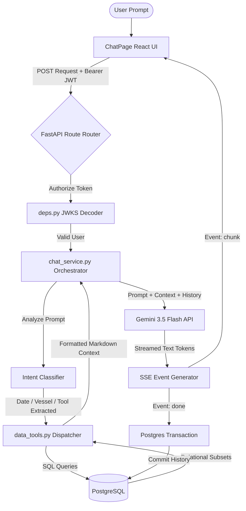

# VPRO (Voyage Performance & Route Optimization) Technical Implementation Report

This report provides a detailed technical implementation overview of the current state of the VPRO Maritime Analytics Platform. It is structured to serve as comprehensive documentation detailing the architecture, features, database models, and service interfaces implemented in the VPRO codebase.

---

## Project Overview

**VPRO (Voyage Performance & Route Optimization)** is an enterprise-grade maritime analytics platform designed to ingest raw Noon Reports (in Excel format), parse and validate them into normalized relational database schemas, calculate operational efficiency metrics, score and recommend shipping routes, and offer a context-aware, secure AI Assistant.

The platform is designed with a modern decoupled architecture:
*   **Backend**: Built on **FastAPI (Python)**, utilizing **SQLAlchemy** for ORM mapping, **Alembic** for migrations, **Supabase Auth** for JWT security (via HS256/ES256 JWKS verification), and the **Google GenAI SDK** for retrieval-augmented prompt engineering.
*   **Frontend**: Developed using **React 19 (TypeScript)** and **Vite**, styled with **Tailwind CSS**, and utilizing **Leaflet** for interactive GIS route visualizations.
*   **Database**: **PostgreSQL** (hosted via Supabase), optimized with index pairings and JSONB archiving.

---

## Complete Feature List

### 1. Noon Report Ingestion & Parser Pipeline
*   **Purpose**: Eliminates manual data entry by allowing users to upload vessel noon reports in Excel (`.xlsx`) format, parse their contents, validate the measurements, and save them in a highly optimized structured format.
*   **User Workflow**:
    1. Navigation to the **Upload Reports** page.
    2. Drag-and-drop or file-picker upload of one or more Excel spreadsheets.
    3. Clicking **Parse & Validate** triggers the backend parser.
    4. The UI displays parsed sheets, showing recognized records and highlighting validation warnings (e.g. out-of-bound speeds, missing timestamps, or coordinates).
    5. Clicking **Commit Ingestion** persists the validated records to the PostgreSQL database.
*   **Backend Implementation**:
    *   **File Parser**: Driven by `openpyxl` in `app/services/file_service.py` and `app/services/ingestion_service.py`. It extracts cells, converts date strings, and matches columns (e.g., fuel ROB, speed, Beaufort scale, drafts) to normalized internal structures.
    *   **Validation**: Performs coordinate validation (checks decimal formatting and hemispheric bounds), range checking (validates speed $0 < \text{knots} < 35$, wind force Beaufort scale $0 \leq B \leq 12$), and dates.
*   **Frontend Implementation**:
    *   Responsive file-drag area built in `UploadReportPage.tsx` using local state machines tracking status: `IDLE` $\rightarrow$ `UPLOADING` $\rightarrow$ `PARSED` $\rightarrow$ `SAVING` $\rightarrow$ `SUCCESS`.
    *   Tabular grids showing parsed records and interactive warning badges highlighting validation metrics before final database commits.
*   **APIs Involved**:
    *   `POST /api/upload`: Receives multi-part file uploads and returns temporary file storage keys.
    *   `POST /api/parser/parse`: Parses the files and returns the extracted JSON representation with inline validation status.
    *   `POST /api/ingestion/commit`: Confirms and writes the parsed data into PostgreSQL.
*   **Database Tables Used**: `vessels`, `daily_reports`.
*   **Important Business Logic**: 
    *   Promotes high-frequency analysis fields (bunker fuel ROB/consumption, Beaufort wind scale, drafts forward/aft, distances sailed, average main engine RPMs) to dedicated, typed database columns for fast indexing.
    *   Preserves the entire unedited Excel row under a JSONB column (`raw_json`) as a historical archive.

### 2. Vessel Performance & Trend Analytics Dashboard
*   **Purpose**: Provides operators with visual tracking tools to monitor speed-fuel profiles, weather patterns, and operational conditions for each vessel.
*   **User Workflow**:
    1. Selects a vessel from the global header dropdown.
    2. The **Dashboard** page dynamically updates to render KPI cards (fuel ROB, average speeds, total distance traveled).
    3. Custom charts display fuel consumption vs. speed plots, Beaufort wind history, and draft variations.
    4. An interactive timeline marks operational status changes (e.g., transition from *At Sea* to *Anchorage*).
*   **Backend Implementation**:
    *   Written in `app/services/analytics_service.py` and `app/services/insights_service.py`.
    *   Queries `daily_reports` filtered by date ranges and vessel identity. It computes rolling averages, fuel efficiency profiles, and flags anomalies (e.g., severe weather windows where Beaufort scale $> 5$).
*   **Frontend Implementation**:
    *   Located in `DashboardPage.tsx`. Renders responsive SVG charts, timeline bars, and custom insight boxes.
*   **APIs Involved**:
    *   `GET /api/vessels`: Fetches the registry of vessels.
    *   `GET /api/analytics/vessel/{id}`: Fetches summary metrics (fuel ROB, averages, counts).
    *   `GET /api/analytics/trends/fuel`: Fetches speed-fuel correlation data.
    *   `GET /api/analytics/trends/speed`: Fetches chronological speed logs.
    *   `GET /api/analytics/trends/weather`: Fetches wind speed and Beaufort indices.
    *   `GET /api/analytics/timeline`: Fetches chronological operating condition flags.
    *   `GET /api/analytics/insights`: Returns computed performance anomalies and suggestions.
*   **Database Tables Used**: `vessels`, `daily_reports`.
*   **Important Business Logic**: 
    *   Classifies operating condition windows (e.g. "Laden" vs. "Ballast") based on draft differences.
    *   Correlates high Beaufort scales with speed drops to calculate weather resistance overheads.

### 3. Route Recommendation & Planner
*   **Purpose**: Recommends optimal routes between commercial ports and scores them based on distance, historical success rates, fuel consumption, and weather risks.
*   **User Workflow**:
    1. Operator navigates to the **Route Planner** page.
    2. Selects an **Origin Port** and a **Destination Port** from the searchable lists.
    3. The application fetches available historical routes and displays them on the interactive map.
    4. An comparative evaluation grid lists each route's distance (nautical miles), estimated fuel cost, and safety scores.
*   **Backend Implementation**:
    *   Located in `app/services/route_recommendation_service.py` and `app/services/route_scoring.py`.
    *   Looks up matching ports and fetches route vectors (ordered waypoints).
    *   Scores routes by evaluating:
        $$\text{Score} = w_1 \times (\text{Distance}) + w_2 \times (\text{Weather Risk}) + w_3 \times (\text{Fuel Estimate})$$
*   **Frontend Implementation**:
    *   Implemented in `RoutePlannerPage.tsx` using `react-leaflet`. Renders the visual map, path polylines, and port markers.
*   **APIs Involved**:
    *   `GET /api/routes/positions`: Returns recent coordinate trails of the selected vessel.
    *   `GET /api/route-planner/recommend`: Returns available route options, waypoints, and comparative scores.
*   **Database Tables Used**: `ports`, `historical_routes`.
*   **Important Business Logic**: 
    *   Avoids straight-line (Haversine) calculations; uses historical waypoint coordinates to map real shipping lanes, including canal transits (e.g., Suez, Panama) and traffic separation zones.

---

## AI Assistant



### 1. Architecture
The AI Assistant is a hybrid system utilizing **Semantic Intent Detection**, **Retrieval-Augmented Generation (RAG)**, and **Structured DB Tool Execution**. 

Instead of passing massive, raw datasets to the LLM, the orchestrator acts as a router: it analyzes the prompt, queries target database tables using optimized queries, compiles these subsets into Markdown context, and feeds it alongside the prompt to the model. Responses are streamed directly to the frontend using **Server-Sent Events (SSE)**.

### 2. Authentication Flow
To ensure data security, all AI Assistant requests are protected:
*   The frontend Axios client attaches the user's active Supabase token to the `Authorization: Bearer <JWT>` header.
*   FastAPI intercepts the request in `app/api/deps.py`. It fetches the public keys from Supabase's JWKS endpoint (`https://<supabase-id>.supabase.co/auth/v1/jwks`) and caches them in memory.
*   The token is verified using `jose.jwt.decode` (handling both legacy `HS256` and asymmetric `ES256` signatures).
*   If valid, the user's Supabase UUID (`sub`) is extracted and injected into the request state as `current_user.id`.

### 3. Session Management
*   Conversations are grouped under `ChatSession` records.
*   If the user starts typing without an active thread selected, the frontend automatically invokes the session creation pipeline, binds it to the selected vessel, and locks the session context.
*   Title Auto-Generation: If a session's title remains `"New conversation"`, the backend automatically updates the title using the first 40 characters of the user's initial message.

### 4. Conversation Storage
Conversations are stored in the database:
*   `chat_sessions` holds the thread metadata, owner's user ID, bound vessel context, and timestamps.
*   `chat_messages` stores individual entries, recording the `role` (`user` or `assistant`), `content`, and the timestamp.

### 5. Prompt Processing & Intent Classification
The orchestrator in `app/services/chat_service.py` evaluates the prompt using standard heuristics to extract:
*   **Vessel Context**: Extracts vessel names or IDs.
*   **Date Window**: Parses relative or absolute date boundaries (e.g. "last 5 days", "between April 22 and April 27"). Defaults to the last 14 days if not specified.
*   **Intended Action**: Maps keywords to the appropriate analytics tools.

### 6. Backend Pipeline & Tools
The platform exposes 8 data tools in `app/services/data_tools.py` that query the database using SQLAlchemy:
1.  `vessel_summary`: Computes aggregate counts and dates of reports.
2.  `fuel_insights`: Extracts daily fuel consumption trends and remaining on board (ROB).
3.  `weather_risk`: Isolates occurrences of severe wind conditions (Beaufort $> 5$).
4.  `operational_timeline`: Summarizes coordinates and operating condition intervals (Sea vs. Port).
5.  `route_recommendation`: Returns active port combinations and optimized route options.
6.  `historical_efficiency`: Summarizes slip averages, RPM distributions, and speed-power ratios.
7.  `vessel_comparison`: Compares fuel efficiency and performance averages between multiple vessels.
8.  `general_query`: Performs keyword-based scans over remarks and operational logs.

### 7. Response Generation
*   **API Client**: Uses the `google-genai` SDK (`gemini-3.5-flash`) or the `openai` SDK, configured dynamically via environment variables.
*   **Streaming**: The completion stream is wrapped in an asynchronous generator that yields chunks as soon as they are generated by the model.

### 8. Database Interactions
Upon stream completion, a standalone database session (`SessionLocal()`) is created. The full model response is joined, saved as a `ChatMessage` with `role="assistant"`, and the session's `updated_at` timestamp is updated in a single transaction.

### 9. API Endpoints
*   `POST /api/chat/sessions`: Creates a new session.
*   `GET /api/chat/sessions`: Lists all sessions belonging to the logged-in user.
*   `DELETE /api/chat/sessions/{session_id}`: Deletes a session and cascades deletion to all its messages.
*   `GET /api/chat/sessions/{session_id}/messages`: Fetches the conversation history.
*   `POST /api/chat/sessions/{session_id}/messages`: Accepts a user question, processes it, retrieves context, and streams the AI's response using an SSE format.

### 10. Frontend UI Implementation
*   Implemented in `ChatPage.tsx`. Features a sidebar drawer showing the user's history of conversations, a main chat window, typing indicators, and metadata badges showing the active vessel, dates, and database tools used for the query.
*   **Markdown Parsing**: Renders responses in real-time using `react-markdown` and `remark-gfm`.
*   **Ref-Based Stream Locking**: Uses `isSendingRef` and `skipLoadMessagesRef` to prevent React state updates from triggering premature message list reloads while the stream is active.

### 11. Security
*   **Multi-Tenant Isolation**: Every SQL query is filtered by the user's validated Supabase ID, preventing access to other users' sessions or history.
*   **No Raw File Injection**: The LLM is never given direct access to files. It only receives pre-aggregated database metrics retrieved by the Python tools.

### 12. Error Handling
*   If token validation fails, the API returns a `401 Unauthorized` response.
*   If the AI provider fails, an `event: error` chunk is sent to the client, displaying a friendly error message, and the database transaction rolls back.
*   **Anti-Buffering Headers**: Explicitly sends `X-Accel-Buffering: no` and `Cache-Control: no-cache` to ensure real-time chunk delivery through Render's proxy.

---

## Authentication

The authentication system leverages **Supabase Auth** for secure user management, including signup, login, and token-based API authentication.

### 1. User Workflows
*   **Signup**: Users register via [SignUpPage.tsx](file:///c:/Users/Asmit%20Bhandari/Desktop/pojects/vessel%20performance%20system/frontend/src/pages/SignUpPage.tsx) using email and password. Upon successful registration, a confirmation panel prompts the user to check their email for verification.
*   **Login**: Users authenticate on [LoginPage.tsx](file:///c:/Users/Asmit%20Bhandari/Desktop/pojects/vessel%20performance%20system/frontend/src/pages/LoginPage.tsx) using email/password or Google OAuth.
*   **Social OAuth Redirect**: Clicking the "Sign in with Google" button redirect the user to Google's authentication consent screen. Upon completion, Google redirects to Supabase, which forwards the user back to the application's root URL.

### 2. JWT Handling & Interceptor Pipeline
*   The frontend uses `@supabase/supabase-js` to handle local session storage and token renewal.
*   An Axios interceptor configured in `frontend/src/services/api.ts` checks for active sessions. If found, it attaches the access token (JWT) to the `Authorization` header of all backend requests:
    ```javascript
    const { data } = await supabase.auth.getSession();
    const token = data.session?.access_token;
    if (token) {
        config.headers.Authorization = `Bearer ${token}`;
    }
    ```
*   The backend verifies the signature of the incoming JWT using public keys fetched dynamically from the Supabase JWKS endpoint.

### 3. Protected Routes & Navigation Guard
*   The router configuration uses [ProtectedRoute.tsx](file:///c:/Users/Asmit%20Bhandari/Desktop/pojects/vessel%20performance%20system/frontend/src/components/ProtectedRoute.tsx) to protect authenticated routes. Unauthenticated users trying to access dashboard metrics, route planners, or the AI Assistant are redirected to the `/login` page.
*   Once authenticated, the main layout displays the user's name/initials in the top header along with a "Sign Out" button.

---

## Backend Architecture

### 1. Route Groups & API Endpoints
All routes are prefixed with `/api` and organized into logical groups:

| Router / Tag | Method | Endpoint | Description |
| :--- | :--- | :--- | :--- |
| **Health** | `GET` | `/api/health` | Validates API status and database connectivity. |
| **Vessels** | `GET` | `/api/vessels` | Returns the list of registered vessels. |
| **Upload** | `POST` | `/api/upload` | Uploads multipart files to the backend server. |
| **Parser** | `POST` | `/api/parser/parse` | Parses raw Excel sheets into JSON format. |
| **Ingestion** | `POST` | `/api/ingestion/commit` | Persists parsed noon report records into the database. |
| **Reports** | `GET` | `/api/reports/vessel/{vessel_id}` | Lists ingested daily reports for a selected vessel. |
| **Analytics** | `GET` | `/api/analytics/vessel/{id}` | Fetches KPI summary metrics. |
| | `GET` | `/api/analytics/trends/fuel` | Speed-fuel consumption data. |
| | `GET` | `/api/analytics/trends/speed` | Chronological speed data. |
| | `GET` | `/api/analytics/trends/weather` | Wind speed and Beaufort logs. |
| | `GET` | `/api/analytics/timeline` | Operating conditions and timestamps. |
| | `GET` | `/api/analytics/insights` | Performance anomalies and warnings. |
| **Routes** | `GET` | `/api/routes/positions` | Fetches coordinate history trails for mapping. |
| **Route Planner** | `GET` | `/api/route-planner/recommend` | Evaluates and recommends routes between two ports. |
| **AI Assistant** | `POST` | `/api/chat/sessions` | Creates a new chat session. |
| | `GET` | `/api/chat/sessions` | Lists chat sessions for the authenticated user. |
| | `DELETE` | `/api/chat/sessions/{id}`| Deletes a session and its message history. |
| | `GET` | `/api/chat/sessions/{id}/messages`| Retrieves messages in a session. |
| | `POST` | `/api/chat/sessions/{id}/messages`| Streams assistant responses via SSE. |

### 2. Services
*   `analytics_service.py`: Computes averages, conditions, and KPI summaries.
*   `insights_service.py`: Analyzes reports to identify hull fouling, engine slip anomalies, and weather overheads.
*   `ingestion_service.py`: Controls parsing, column mapping, coordinate conversion, and database insertions.
*   `chat_service.py`: Intent classification, prompt building, LLM streaming, and history formatting.
*   `data_tools.py`: Connects the AI orchestrator to database tables.
*   `route_recommendation_service.py` & `route_scoring.py`: Filters port coordinates and scores alternative routes.
*   `file_service.py`: Handles temporary file saving and Excel file verification.

### 3. Middleware
*   **CORS Middleware**: Allows requests, credentials, and custom headers from trusted origins (configured via `CORS_ORIGINS`).

---

## Frontend Architecture

The frontend is structured into a modular hierarchy:

### 1. Pages (`frontend/src/pages/`)
*   `HomePage.tsx`: Overview of the platform with links to modules.
*   `DashboardPage.tsx`: Interactive analytical dashboards.
*   `UploadReportPage.tsx`: Drag-and-drop noon report parser interface.
*   `RoutePlannerPage.tsx`: GIS interactive map and route comparison panel.
*   `ChatPage.tsx`: Workspace for the AI Assistant.
*   `LoginPage.tsx` & `SignUpPage.tsx`: Authentication portals.

### 2. Key Components
*   `AppLayout.tsx`: Common shell layout containing the sidebar navigation, authentication header, and profile dropdowns.
*   `ProtectedRoute.tsx`: Protects authenticated routes from unauthorized access.

### 3. Context Providers
*   `AuthContext.tsx`: Manages authentication state, token refreshes, and Google OAuth redirects.

### 4. Routing
Defined in `src/router/router.tsx` using `react-router-dom`, mapping paths to protected components.

---

## Database

The PostgreSQL schema is structured to support high-frequency analytics queries while archiving raw payloads.

```
                     +-------------------+
                     |      vessels      |
                     +-------------------+
                     | id (PK)           |
                     | vessel_name (UQ)  |
                     +-------------------+
                       /               \
                      /                 \
                     /                   \
+-------------------------+         +-------------------------+
|      daily_reports      |         |      chat_sessions      |
+-------------------------+         +-------------------------+
| id (PK)                 |         | id (PK)                 |
| vessel_id (FK)          |         | user_id                 |
| voyage_id (FK, Nullable)|<---+    | vessel_id (FK)          |
| report_date             |    |    +-------------------------+
| raw_json (JSONB)        |    |                 |
+-------------------------+    |                 |
                               |                 |
+-------------------------+    |    +-------------------------+
|         voyages         |    |    |      chat_messages      |
+-------------------------+    |    +-------------------------+
| id (PK)                 |----+    | id (PK)                 |
| vessel_id (FK)          |         | session_id (FK, Cascade)|
+-------------------------+         | role ("user"|"assistant")|
                                    | vessel_id (FK)          |
                                    +-------------------------+
```

### 1. Database Tables & Purposes
*   **`vessels`**: Registry of vessels.
    *   *Columns*: `id` (PK), `vessel_name` (Unique), `technical_manager`, `created_at`, `updated_at`.
*   **`voyages`**: Optional grouping of daily reports under voyages.
    *   *Columns*: `id` (PK), `vessel_id` (FK), `voyage_number`, `departure_port`, `arrival_port`, `start_date`, `end_date`, `created_at`, `updated_at`.
*   **`ports`**: Commercial ports used for route planning.
    *   *Columns*: `id` (PK), `name` (Unique), `country`, `latitude`, `longitude`, `code`, `created_at`, `updated_at`.
*   **`historical_routes`**: Waypoints and routes between ports.
    *   *Columns*: `id` (PK), `origin_port_id` (FK), `destination_port_id` (FK), `route_name`, `route_distance_nm`, `route_type`, `is_primary`, `waypoints` (JSONB), `weather_risk`, `fuel_estimate_mt`, `confidence`, `historical_success_rate`, `created_at`, `updated_at`.
*   **`daily_reports`**: Main analytics table storing noon reports.
    *   *Columns*: `id` (PK), `vessel_id` (FK), `voyage_id` (FK, Null), `report_date`, `latitude_decimal`, `longitude_decimal`, `total_hsfo_consumption`, `total_lsfo_consumption`, `total_mgo_consumption`, `hsfo_rob`, `lsfo_rob`, `mgo_rob`, `distance_sailed`, `speed_last_24hrs`, `avg_speed`, `beaufort_scale`, `wind_speed`, `draft_forward`, `draft_aft`, `raw_json` (JSONB), `source_file_name`, `ingested_at`, `created_at`, `updated_at`.
    *   *Constraints*: `uq_vessel_report_date` (Unique constraint on `vessel_id` + `report_date`) prevents duplicate report dates for a vessel.
*   **`chat_sessions`**: AI conversation threads.
    *   *Columns*: `id` (PK), `user_id` (String index), `title`, `vessel_id` (FK, Null), `created_at`, `updated_at`.
*   **`chat_messages`**: Message history within threads.
    *   *Columns*: `id` (PK), `session_id` (FK, Cascade), `role` (`"user"` or `"assistant"`), `content`, `vessel_id` (FK, Null), `created_at`.

### 2. Schema Migrations (Alembic)
*   `9a3b839f99cf_create_chat_tables.py`: Creates `chat_sessions` and `chat_messages` tables, adding index constraints on the user ID, foreign key references, and cascade delete rules.

---

## Technical Libraries Used

### Backend Dependencies
*   `fastapi` & `uvicorn`: ASGI web framework and server.
*   `sqlalchemy` & `psycopg2-binary`: ORM and database connector.
*   `alembic`: Database migration tool.
*   `openpyxl`: Excel parser.
*   `sse-starlette`: Stream server-sent events.
*   `python-jose[cryptography]`: JWT decoding and JWKS key parsing.
*   `google-genai`: Integrates the Gemini API.
*   `openai`: Fallback for OpenAI compatible LLM clients.

### Frontend Dependencies
*   `react` (v19) & `react-dom`: UI framework.
*   `vite`: Asset bundler.
*   `@supabase/supabase-js`: Supabase Auth client.
*   `leaflet` & `react-leaflet`: Maps and GIS polyline rendering.
*   `axios`: HTTP client.
*   `react-markdown` & `remark-gfm`: Real-time streaming markdown renderer.
*   `tailwindcss`: CSS framework.

---

## Testing Performed

1.  **Frontend Compilation Checks**: Verified compilation and code safety using `npx tsc --noEmit`. Verified that the static build succeeds using `npm run build`.
2.  **Backend Startup Integrity Checks**: Verified Python import structures and dependency resolutions by launching the FastAPI service locally.
3.  **SSE Streaming Tests**: Tested the SSE streaming pipeline to confirm that multi-line markdown tables and bulleted responses parse and stream correctly to the UI without blocking FastAPI's event loop.
4.  **Auth Verification Tests**: Tested asymmetric ES256 signature verification using public keys fetched dynamically from the Supabase JWKS endpoint.

---

## Production Deployment

The project is configured for deployment on **Render**:
*   **Web Service (Backend)**: Root directory `backend`, using `pip install -r requirements.txt` as build command, and `uvicorn app.main:app --host 0.0.0.0 --port $PORT` as start command. Database migrations are applied automatically during deployment using the pre-deploy hook: `alembic upgrade head`.
*   **Static Site (Frontend)**: Root directory `frontend`, using `npm run build` as build command and `dist` as publish directory. Redirect routing rules redirect all subpaths (`/*`) to `/index.html` to support client-side routing.
*   **Database**: PostgreSQL hosted on Supabase, connected directly via connection strings.

---

## Current Project Status

The VPRO platform is fully implemented and operational:
*   **Ingestion**: Parses raw noon reports and saves them to the database.
*   **Analytics**: KPI cards and trends dashboard render vessel performance metrics.
*   **Route Planner**: Computes and displays route recommendations and waypoint maps.
*   **Authentication**: Secure Google OAuth and Email signups/logins are active.
*   **AI Assistant**: Real-time streaming responses with context retrieval are fully functional on both local and production environments.
